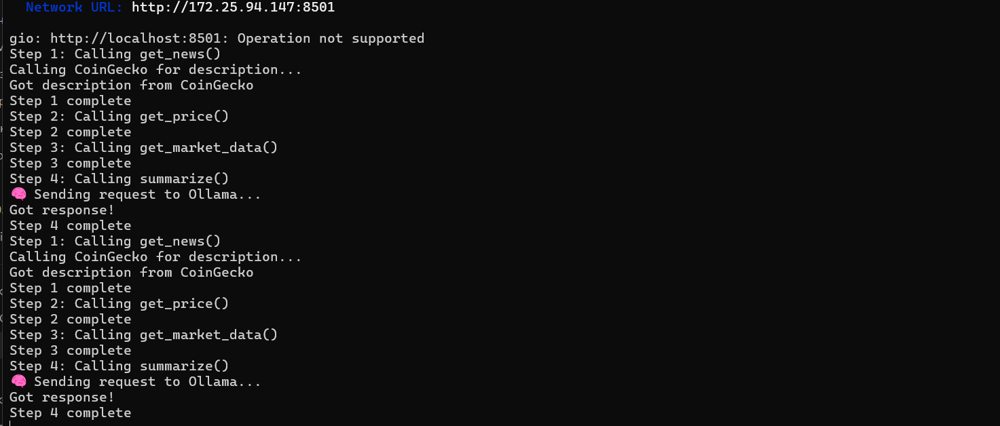
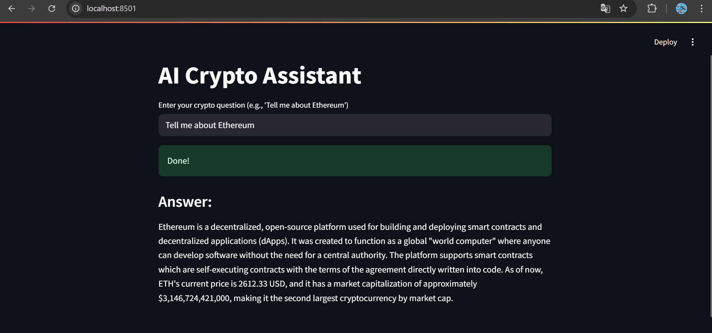

# 🧠 AI Crypto Assistant

An AI-powered assistant that answers cryptocurrency questions using live off-chain data and local LLMs via Ollama.

## 🔧 Usage

### 1. Install Ollama inside WSL or Linux:

```bash
curl -fsSL https://ollama.com/install.sh | sh
ollama pull mistral
```

Make sure the model is running:

```bash
ollama run mistral
```

### 2. Install dependencies:

```bash
pip install -r requirements.txt
```

### 3. Run the app:

```bash
streamlit run app.py
```

Then open `http://localhost:8501` in your browser.

---

## 📷 Demo Screenshot




_Example: User asks about Bitcoin. The assistant responds with current price, market cap, and AI summary._

---

## 💡 Example Queries

- `Tell me about Bitcoin`
- `What is the current price of Ethereum?`
- `Give me details on Solana`

The assistant fetches:

- 📈 Live price from Binance
- 📊 Market cap and rank from CoinGecko
- 🧠 Token description from CoinGecko
- 🗣 Natural language summary using `mistral` via Ollama

---

## 📁 Project Structure

```
ai-crypto-assistant/
├── app.py
├── services/
│   ├── news.py
│   ├── price.py
│   └── market.py
├── utils/
│   └── summarizer.py
├── .gitignore
├── README.md
└── LICENSE
```

---

## 📄 License

This project is licensed under the [MIT License](LICENSE).

Powered by:
- Ollama — https://ollama.com
- CoinGecko API — https://coingecko.com
- Streamlit — https://streamlit.io
